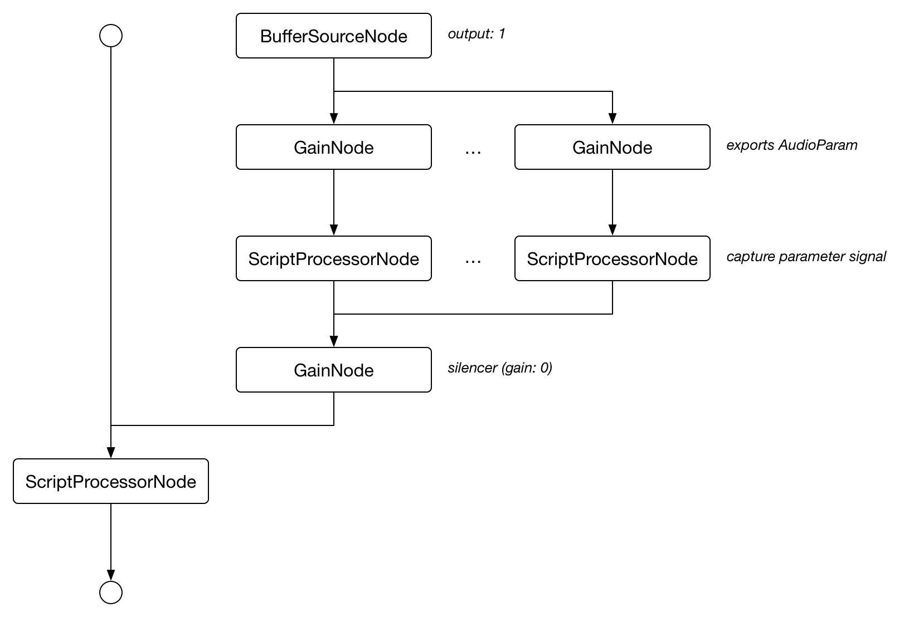

# AudioWorkerNode
[](https://travis-ci.org/mohayonao/audio-worker-node)
[](https://www.npmjs.org/package/audio-worker-node)
[](http://mohayonao.mit-license.org/)

This module is a sub module for [audio-worker-shim](https://github.com/mohayonao/audio-worker-shim).

## Installation

```
$ npm install audio-worker-node
```

## API
### AudioWorkerCompiler
- `constructor(audioContext: AudioContext, audioprocess: function, opts: object): ScriptProcessorNode`

## Audio Graph



## License

MIT
